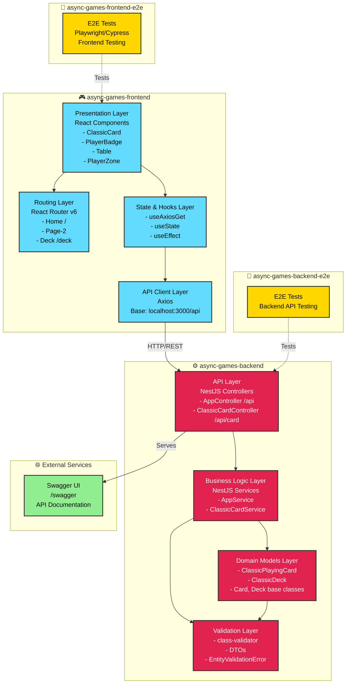

# Async Games - Architecture Diagram

This document provides a visual representation of the Async Games platform architecture, showing the different applications, their layers, and how they interact.

## Architecture Overview



## Layer Descriptions

### Frontend (async-games-frontend)

#### 1. **Presentation Layer**
- **Technology**: React 18 with TypeScript
- **Components**:
  - `ClassicCard`: Renders playing cards with suits and values
  - `PlayerBadge`: Displays player information and status
  - `Table`: Game board layout supporting 1-4 players
  - `PlayerZone`: Individual player area with cards
- **Styling**: Tailwind CSS with custom card designs

#### 2. **Routing Layer**
- **Technology**: React Router v6
- **Routes**:
  - `/` - Home page
  - `/page-2` - Example page
  - `/deck` - Card deck viewer
- **Navigation**: BrowserRouter with nested routes

#### 3. **State & Hooks Layer**
- **Pattern**: React Hooks (no global state management)
- **Custom Hooks**:
  - `useAxiosGet<T>`: Type-safe data fetching with loading/error states
- **State Management**: Local component state with `useState`
- **Memoization**: `useMemo` for performance optimization

#### 4. **API Client Layer**
- **HTTP Client**: Axios
- **Base URL**: `http://localhost:3000/api`
- **Features**:
  - Type-safe URL builder with search params
  - Generic response typing
  - Error handling

### Backend (async-games-backend)

#### 1. **API Layer**
- **Framework**: NestJS
- **Controllers**:
  - `AppController`: Root endpoint (`/api`)
  - `ClassicCardController`: Card operations (`/api/card`)
- **Documentation**: Swagger/OpenAPI at `/swagger`
- **Global Prefix**: `/api`

#### 2. **Business Logic Layer**
- **Services**:
  - `AppService`: Core application logic
  - `ClassicCardService`: Card game business rules
- **Operations**:
  - Get single card by name and suit
  - Generate full deck with options
  - Set trump suit (TODO)
  - Shuffle deck (TODO)

#### 3. **Domain Models Layer**
- **Abstract Base Classes**:
  - `Card`: Generic card interface
  - `Deck`: Generic deck operations
- **Concrete Implementations**:
  - `ClassicPlayingCard`: Traditional playing card (suit, value, color)
  - `ClassicDeck`: 52-card deck with shuffle/draw/deal methods
- **Pattern**: Domain-Driven Design (DDD)

#### 4. **Validation Layer**
- **Technology**: class-validator
- **Components**:
  - DTOs with validation decorators
  - Custom validators for card entities
  - `EntityValidationError` (HTTP 422)
- **Validation Rules**:
  - Suit validation (spades, hearts, clubs, diamonds)
  - Card name validation (2-10, J, Q, K, A, Joker)
  - Deck options validation

### Testing Applications

#### Frontend E2E (async-games-frontend-e2e)
- End-to-end testing for frontend UI and user flows
- Tests user interactions and page rendering
- Likely using Playwright or Cypress

#### Backend E2E (async-games-backend-e2e)
- API endpoint testing
- Integration tests for backend services
- HTTP request/response validation

### External Services

#### Swagger Documentation
- **Endpoint**: `/swagger`
- **Purpose**: Interactive API documentation
- **Auto-generated**: From NestJS decorators and DTOs

## Data Flow

### Card Fetching Flow
```
User Request → Frontend UI → useAxiosGet Hook → 
Axios HTTP Client → Backend Controller → Service → 
Domain Model → Response → Frontend State → UI Render
```

### Validation Flow
```
API Request → Controller → DTO Validation → 
Service → Entity Validation → Domain Model → 
Success/Error Response
```

## Technology Stack

### Frontend
- **Framework**: React 18
- **Language**: TypeScript
- **Styling**: Tailwind CSS
- **HTTP**: Axios
- **Routing**: React Router v6
- **Build**: Vite
- **Storybook**: Component development

### Backend
- **Framework**: NestJS
- **Language**: TypeScript
- **Validation**: class-validator
- **Documentation**: Swagger/OpenAPI
- **Build**: Webpack with NX

### Monorepo
- **Manager**: Nx
- **Package Manager**: npm
- **Build System**: Nx task orchestration

## Future Architecture Considerations

Based on TODO comments and current limitations:

1. **Persistence Layer**: Add database (PostgreSQL/MongoDB) with repository pattern
2. **Authentication**: Implement user authentication and session management
3. **WebSocket Layer**: Real-time game updates for async play
4. **Game State Management**: State machine for game flow
5. **Player Management**: User accounts and friend systems
6. **Game Lobby**: Matchmaking and game session creation
7. **Frontend State Management**: Consider Redux/Zustand for complex state
8. **Caching Layer**: Redis for game state and session data
9. **File Storage**: For card images and game assets
10. **Notification System**: For turn notifications and game updates

## Design Principles

1. **Domain-Driven Design**: Clear domain separation (cards, players, tables)
2. **Type Safety**: Strong TypeScript typing throughout
3. **Modularity**: Feature-based module organization
4. **Separation of Concerns**: Clear layer boundaries
5. **Testability**: E2E test applications for both frontend and backend
6. **API-First**: RESTful API with OpenAPI documentation
7. **Component-Based**: Reusable UI components with Storybook
