# Async Games - Architecture Diagram

This document provides a visual representation of the Async Games platform architecture, showing the different applications, their layers, and how they interact.

## Architecture Overview

```mermaid
graph TB
    subgraph Frontend["🎮 async-games-frontend"]
        direction TB
        UI[Presentation Layer<br/>React Components]
        Router[Routing Layer<br/>React Router v6]
        Hooks[State & Hooks Layer<br/>Custom Hooks]
        APIClient[API Client Layer<br/>Axios]
        
        UI --> Router
        UI --> Hooks
        Hooks --> APIClient
    end

    subgraph Backend["⚙️ async-games-backend"]
        direction TB
        Controllers[API Layer<br/>NestJS Controllers]
        Services[Business Logic Layer<br/>NestJS Services]
        Domain[Domain Models Layer<br/>Game Entities]
        Validation[Validation Layer<br/>class-validator]
        
        Controllers --> Services
        Services --> Domain
        Services --> Validation
        Domain --> Validation
    end

    subgraph FrontendE2E["🧪 async-games-frontend-e2e"]
        direction TB
        E2EFrontend[E2E Tests<br/>Frontend Testing]
    end

    subgraph BackendE2E["🧪 async-games-backend-e2e"]
        direction TB
        E2EBackend[E2E Tests<br/>API Testing]
    end

    subgraph External["🌐 External Services"]
        direction TB
        Swagger[Swagger UI<br/>API Documentation]
    end

    APIClient -->|HTTP/REST| Controllers
    E2EFrontend -.->|Tests| UI
    E2EBackend -.->|Tests| Controllers
    Controllers -->|Serves| Swagger

    classDef frontendStyle fill:#61dafb,stroke:#333,stroke-width:2px,color:#000
    classDef backendStyle fill:#e0234e,stroke:#333,stroke-width:2px,color:#fff
    classDef testStyle fill:#ffd700,stroke:#333,stroke-width:2px,color:#000
    classDef externalStyle fill:#90ee90,stroke:#333,stroke-width:2px,color:#000
    
    class UI,Router,Hooks,APIClient frontendStyle
    class Controllers,Services,Domain,Validation backendStyle
    class E2EFrontend,E2EBackend testStyle
    class Swagger externalStyle
```

## Layer Descriptions

### Frontend (async-games-frontend)

#### 1. **Presentation Layer**
- **Technology**: React 18 with TypeScript
- **Components**: Reusable UI components for game elements
- **Styling**: Tailwind CSS with custom designs
- **Purpose**: Render user interface and handle user interactions

#### 2. **Routing Layer**
- **Technology**: React Router v6
- **Navigation**: BrowserRouter with nested routes
- **Purpose**: Handle client-side navigation and route management

#### 3. **State & Hooks Layer**
- **Pattern**: React Hooks (no global state management)
- **Custom Hooks**: Type-safe data fetching with loading/error states
- **State Management**: Local component state
- **Optimization**: Memoization for performance

#### 4. **API Client Layer**
- **HTTP Client**: Axios
- **Features**:
  - Type-safe URL builder with search params
  - Generic response typing
  - Error handling
- **Purpose**: Abstract backend communication and manage API requests

### Backend (async-games-backend)

#### 1. **API Layer**
- **Framework**: NestJS
- **Controllers**: Handle HTTP requests and responses
- **Documentation**: Swagger/OpenAPI
- **Global Prefix**: `/api`

#### 2. **Business Logic Layer**
- **Services**: Implement game rules, business logic, and orchestration
- **Pattern**: Service-oriented architecture
- **Responsibilities**:
  - Game state management
  - Business rule validation
  - Data transformation

#### 3. **Domain Models Layer**
- **Pattern**: Domain-Driven Design (DDD)
- **Purpose**: Represent core business entities and game state
- **Structure**:
  - Abstract base classes for extensibility
  - Concrete implementations for specific game types
  - Encapsulates game logic and rules

#### 4. **Validation Layer**
- **Technology**: class-validator
- **Components**:
  - DTOs with validation decorators
  - Custom entity validators
  - Error handling with appropriate HTTP status codes
- **Purpose**: Ensure data integrity and business rule compliance

### Testing Applications

#### Frontend E2E (async-games-frontend-e2e)
- End-to-end testing for frontend UI and user flows
- Tests user interactions and page rendering

#### Backend E2E (async-games-backend-e2e)
- API endpoint testing
- Integration tests for backend services

### External Services

#### Swagger Documentation
- Interactive API documentation
- Auto-generated from NestJS decorators and DTOs

## Data Flow

### Card Fetching Flow

### Validation Flow

## Technology Stack

### Frontend
- **Framework**: React 18
- **Language**: TypeScript
- **Styling**: Tailwind CSS
- **HTTP**: Axios
- **Routing**: React Router v6
- **Build**: Vite
- **Storybook**: Component development

### Backend
- **Framework**: NestJS
- **Language**: TypeScript
- **Validation**: class-validator
- **Documentation**: Swagger/OpenAPI
- **Build**: Webpack with NX

### Monorepo
- **Manager**: Nx
- **Package Manager**: npm
- **Build System**: Nx task orchestration

## Future Architecture Considerations

Based on TODO comments and current limitations:

1. **Persistence Layer**: Add database (PostgreSQL/MongoDB) with repository pattern
2. **Authentication**: Implement user authentication and session management
3. **WebSocket Layer**: Real-time game updates for async play
4. **Game State Management**: State machine for game flow
5. **Player Management**: User accounts and friend systems
6. **Game Lobby**: Matchmaking and game session creation
7. **Frontend State Management**: Consider Redux/Zustand for complex state
8. **Caching Layer**: Redis for game state and session data
9. **File Storage**: For card images and game assets
10. **Notification System**: For turn notifications and game updates

## Design Principles

1. **Domain-Driven Design**: Clear domain separation (cards, players, tables)
2. **Type Safety**: Strong TypeScript typing throughout
3. **Modularity**: Feature-based module organization
4. **Separation of Concerns**: Clear layer boundaries
5. **Testability**: E2E test applications for both frontend and backend
6. **API-First**: RESTful API with OpenAPI documentation
7. **Component-Based**: Reusable UI components with Storybook
