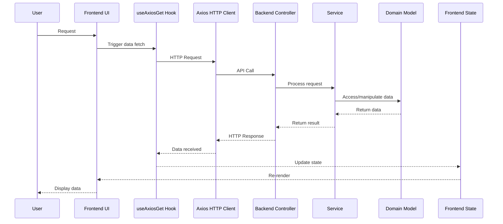
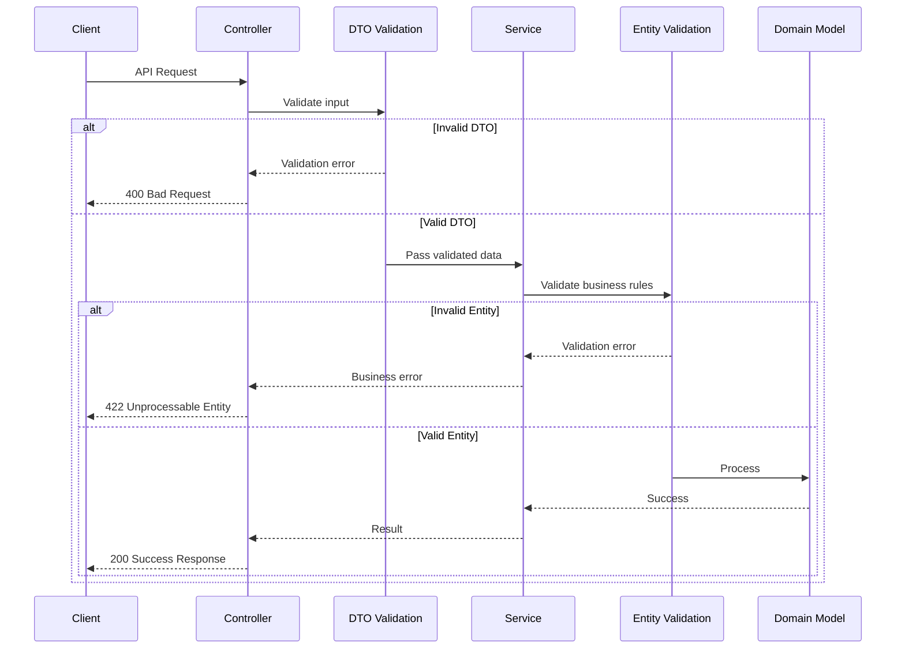

# Async Games - Architecture Diagram

This document provides a visual representation of the Async Games platform architecture, showing the different applications, their layers, and how they interact. Async-Games follows a client–server architecture in which the backend is the authoritative source of truth for all game state while the frontend focuses on rendering and interaction.

## System Overview & Principles

- See the [System Architecture Diagram](diagrams/system-architecture.md) for another visualization of the component boundaries.
- See the [System Sequence Diagram](diagrams/system-sequence.md) for a complementary view of request and response lifecycles.

### Core Architectural Principles

1. The backend owns all game state and authoritative transitions.
2. Every game-state mutation is validated on the server before it is persisted or broadcast.
3. Game state is persisted so it can be replayed and audited historically.
4. The frontend renders state but never enforces game rules independently.

### High-Level Interaction Flow

Clients submit actions to the backend, which validates the request, applies domain rules, persists state transitions, and returns the updated view model for rendering. Automated end-to-end tests cover the same high-level sequence to ensure regressions are caught early.

## Architecture Overview

```mermaid
graph TB
    subgraph Frontend["🎮 async-games-frontend"]
        direction TB
        UI[Presentation Layer<br/>React Components]
        Router[Routing Layer<br/>React Router v6]
        Hooks[State & Hooks Layer<br/>Custom Hooks]
        APIClient[API Client Layer<br/>Axios]
        
        UI --> Router
        UI --> Hooks
        Hooks --> APIClient
    end

    subgraph Backend["⚙️ async-games-backend"]
        direction TB
        Controllers[API Layer<br/>NestJS Controllers]
        Services[Business Logic Layer<br/>NestJS Services]
        Domain[Domain Models Layer<br/>Game Entities]
        Validation[Validation Layer<br/>class-validator]
        
        Controllers --> Services
        Services --> Domain
        Services --> Validation
        Domain --> Validation
    end

    subgraph FrontendE2E["🧪 async-games-frontend-e2e"]
        direction TB
        E2EFrontend[E2E Tests<br/>Frontend Testing]
    end

    subgraph BackendE2E["🧪 async-games-backend-e2e"]
        direction TB
        E2EBackend[E2E Tests<br/>API Testing]
    end

    subgraph External["🌐 External Services"]
        direction TB
        Swagger[Swagger UI<br/>API Documentation]
    end

    APIClient -->|HTTP/REST| Controllers
    E2EFrontend -.->|Tests| UI
    E2EBackend -.->|Tests| Controllers
    Controllers -->|Serves| Swagger

    classDef frontendStyle fill:#61dafb,stroke:#333,stroke-width:2px,color:#000
    classDef backendStyle fill:#e0234e,stroke:#333,stroke-width:2px,color:#fff
    classDef testStyle fill:#ffd700,stroke:#333,stroke-width:2px,color:#000
    classDef externalStyle fill:#90ee90,stroke:#333,stroke-width:2px,color:#000
    
    class UI,Router,Hooks,APIClient frontendStyle
    class Controllers,Services,Domain,Validation backendStyle
    class E2EFrontend,E2EBackend testStyle
    class Swagger externalStyle
```

## Layer Descriptions

### Frontend (async-games-frontend)

#### 1. **Presentation Layer**
- **Technology**: React 18 with TypeScript
- **Components**: Reusable UI components for game elements
- **Styling**: Tailwind CSS with custom designs
- **Purpose**: Render user interface and handle user interactions

#### 2. **Routing Layer**
- **Technology**: React Router v6
- **Navigation**: BrowserRouter with nested routes
- **Purpose**: Handle client-side navigation and route management

#### 3. **State & Hooks Layer**
- **Pattern**: React Hooks (no global state management)
- **Custom Hooks**: Type-safe data fetching with loading/error states
- **State Management**: Local component state
- **Optimization**: Memoization for performance

#### 4. **API Client Layer**
- **HTTP Client**: Axios
- **Features**:
  - Type-safe URL builder with search params
  - Generic response typing
  - Error handling
- **Purpose**: Abstract backend communication and manage API requests

### Backend (async-games-backend)

#### 1. **API Layer**
- **Framework**: NestJS
- **Controllers**: Handle HTTP requests and responses
- **Documentation**: Swagger/OpenAPI
- **Global Prefix**: `/api`

#### 2. **Business Logic Layer**
- **Services**: Implement game rules, business logic, and orchestration
- **Pattern**: Service-oriented architecture
- **Responsibilities**:
  - Game state management
  - Business rule validation
  - Data transformation

#### 3. **Domain Models Layer**
- **Pattern**: Domain-Driven Design (DDD)
- **Purpose**: Represent core business entities and game state
- **Structure**:
  - Abstract base classes for extensibility
  - Concrete implementations for specific game types
  - Encapsulates game logic and rules

#### 4. **Validation Layer**
- **Technology**: class-validator
- **Components**:
  - DTOs with validation decorators
  - Custom entity validators
  - Error handling with appropriate HTTP status codes
- **Purpose**: Ensure data integrity and business rule compliance

### Testing Applications

#### Frontend E2E (async-games-frontend-e2e)
- End-to-end testing for frontend UI and user flows
- Tests user interactions and page rendering

#### Backend E2E (async-games-backend-e2e)
- API endpoint testing
- Integration tests for backend services

### External Services

#### Swagger Documentation
- Interactive API documentation
- Auto-generated from NestJS decorators and DTOs

## Monorepo & Tooling

Async-Games lives in an Nx-powered monorepo to keep frontend, backend, and testing projects aligned. Nx enforces dependency boundaries, provides a shared task runner, and surfaces a dependency graph so contributors can reason about impact quickly. The setup intentionally favors shared type safety, reproducible builds, and CI-friendly caching through Nx Cloud.

## Frontend Platform

### React + Vite

- React (with TypeScript) powers the presentation, routing, and hooks layers for predictable UI composition.
- Vite delivers fast local development cycles and a thin configuration surface—ideal for rapidly iterating on state-driven UIs.
- Tailwind CSS keeps styling composable and consistent across components. The focus remains on deterministic rendering of state rather than elaborate visuals.

### Storybook

Storybook supports isolated UI development and documentation. Building components in Storybook encourages clear separation of rendering and data concerns, makes state exploration easier, and offers a lightweight space for visual regression checks outside the main apps.

## Backend Platform

### NestJS Application Core

- Emphasizes clear modules, dependency injection, and TypeScript-first patterns suited for complex rule engines.
- Provides structured routing, validation, and testing primitives ideal for maintaining an authoritative game server.
- Backend responsibilities include owning game state, enforcing turn order, and guaranteeing deterministic validation of every move.

### API Documentation & Contracts

OpenAPI/Swagger definitions are generated directly from NestJS controllers and DTOs. This keeps frontend and potential third parties aligned on request/response contracts, highlights state transition endpoints, and makes manual testing straightforward.

## Testing Strategy & Tooling

### Unit & Domain Tests (Jest)

Jest covers domain logic, rule enforcement, and turn validation. The goal is to catch mistakes where game rules live—inside services and entities—before they reach integration environments.

### End-to-End & Integration (Playwright)

Playwright-based projects (`async-games-frontend-e2e` and `async-games-backend-e2e`) validate cross-layer flows, exercise HTTP boundaries, and guard asynchronous interactions. They complement the Jest suite by simulating real user or API traffic.

## CI/CD

GitHub Actions, coupled with Nx Cloud caching, runs linting, unit tests, E2E tests, and build verification. The pipeline is intentionally lean but gives fast feedback on core interaction patterns and enforces consistent tooling across contributors.

## Current Scope

- Card and deck entities
- Turn progression logic
- Minimal table rendering
- Limited endpoints for core state interactions, primarily exercised in development environments

## Future Architectural Considerations

- Game-state history replay and auditing
- Interrupt-driven action modeling
- Game-engine abstractions to support multiple games
- Notification systems tied to state transitions

## Data Flow

### Card Fetching Flow

### Validation Flow

## Technology Stack

### Frontend
- **Framework**: React 18
- **Language**: TypeScript
- **Styling**: Tailwind CSS
- **HTTP**: Axios
- **Routing**: React Router v6
- **Build**: Vite
- **Storybook**: Component development

### Backend
- **Framework**: NestJS
- **Language**: TypeScript
- **Validation**: class-validator
- **Documentation**: Swagger/OpenAPI
- **Build**: Webpack with NX

### Monorepo
- **Manager**: Nx
- **Package Manager**: npm
- **Build System**: Nx task orchestration

## Future Architecture Considerations

Based on TODO comments and current limitations:

1. **Persistence Layer**: Add database (PostgreSQL/MongoDB) with repository pattern
2. **Authentication**: Implement user authentication and session management
3. **WebSocket Layer**: Real-time game updates for async play
4. **Game State Management**: State machine for game flow
5. **Player Management**: User accounts and friend systems
6. **Game Lobby**: Matchmaking and game session creation
7. **Frontend State Management**: Consider Redux/Zustand for complex state
8. **Caching Layer**: Redis for game state and session data
9. **File Storage**: For card images and game assets
10. **Notification System**: For turn notifications and game updates

## Design Principles

1. **Domain-Driven Design**: Clear domain separation (cards, players, tables)
2. **Type Safety**: Strong TypeScript typing throughout
3. **Modularity**: Feature-based module organization
4. **Separation of Concerns**: Clear layer boundaries
5. **Testability**: E2E test applications for both frontend and backend
6. **API-First**: RESTful API with OpenAPI documentation
7. **Component-Based**: Reusable UI components with Storybook
